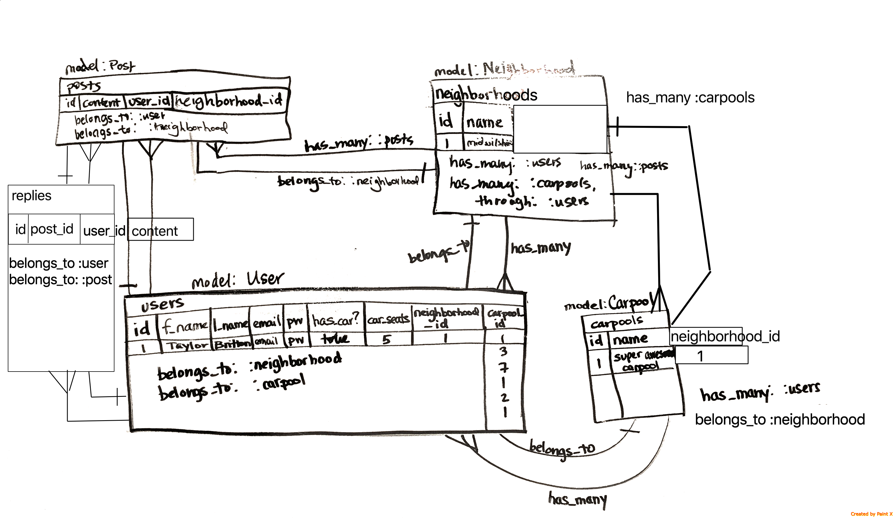
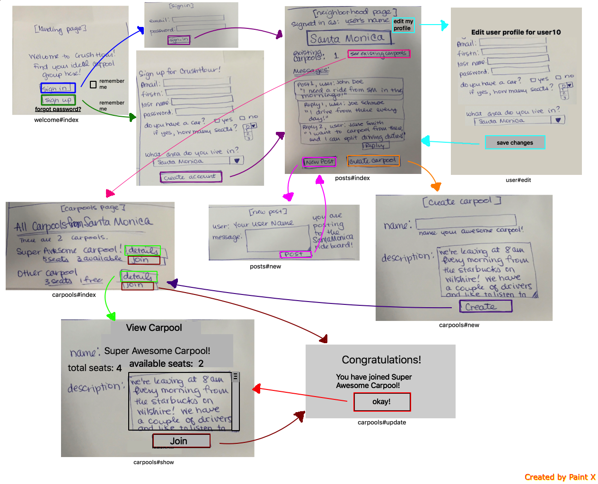

#Project 2 README
### Diamond Lane: GA Carpool application

####Link to app hosted on Heroku
https://carpool-app-project-2.herokuapp.com/

####Project Board on Trello
https://trello.com/b/29l8TAg4/project2

####Technologies
- Ruby on Rails
- PostgreSQL
- HTML5
- CSS
- Bootstrap
- Heroku
- Devise

####Description:
This app will provide a place for people to connect with coworkers or fellow students who live near them and are interested in carpooling! After creating an account, a user can access the ride board for their neighborhood/area and post messages detailing their commuting schedules, what they are looking for, and other details.  They can then start carpools or join existing groups.

The MVP is for a single workplace/school (GA) with many employees/students commuting from different areas. It will allow users to create and view carpools and join one after posting discussion about their commuting habits.

####Approach Taken
I approached the app as a five model system, with the 5 models being Users, Neighborhoods, Carpools, Posts, and Replies. I used the ERD to determine what should be connected: each User belongs to one neighborhood, one carpool, many posts, and many replies. Each neighborhood can have many carpools, posts, and replies.  

####Installation/Startup
Visit https://carpool-app-project-2.herokuapp.com/ to run the app in your browser. In order to download it,, visit https://github.com/hippoish/project2 and click the green 'Clone or Download' button in the top right corner of the page. When you open the app, use the 'Sign Up' button on the welcome page to create an account and get started.

####Unsolved Problems and Next Steps
I would like to ultimately make the app more secure and more useful for actually planning. I want to limit users in a carpool based on seats (info I already have available), integrate maps for more precise matching of users, etc. I would like to have an administrator who has to confirm when a user signs up that they are a member of the GA community, for security reasons. I would also like to be able to have a scheduling function of some sort to allow users to keep track of their day to day carpool schedule and allow them to be in more than one carpool if appropriate.

####ERD:

####Wireframes:

