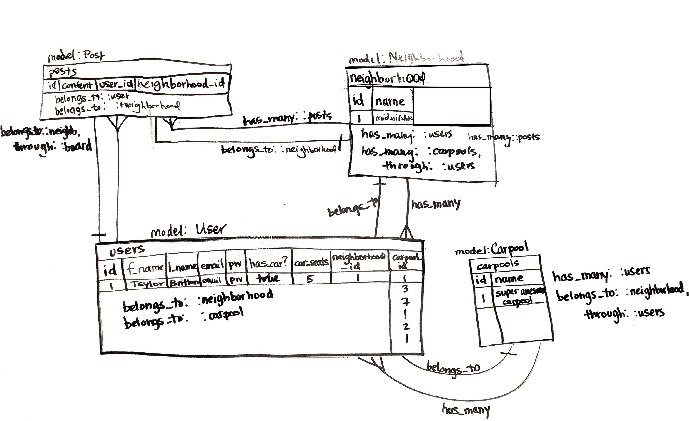
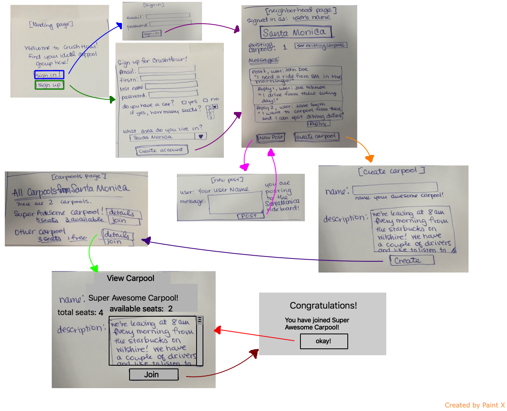

#Project 2 README
### Commute RideShare/Carpool application

####Project Board on Trello
https://trello.com/b/29l8TAg4/project2

####Description:
This app will provide a place for people to connect with coworkers or fellow students who live near them and are interested in carpooling! After creating an account, a user can access the ride board for their neighborhood/area and post messages detailing their commuting schedules, what they are looking for, and other details.  They can then start carpools or join existing groups.

The MVP will be for a single workplace/school with many employees commuting from different areas. It will allow users to create and view carpools and join one at a time. A stretch goal is to integrate mapping functionality to locate and group users.

####ERD:

####Wireframes:

